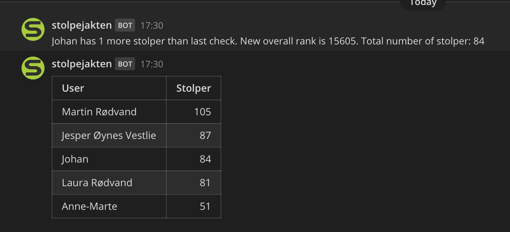

# stolpejakten-mattermost
Integrasjon mellom Stolpejakten-gruppe og Mattermost.
```
usage: main.py [-h] [-d] [-t] [-m] [-g]

Print stolpejakten data to Mattermost

optional arguments:
  -h, --help         show this help message and exit
  -d, --debug        Debug the application
  -t, --toplist      Send top list only
  -m, --mattermost   Send data to mattermost
  -g, --printgroups  Print groups where I am a member
```



## Setup
Nødvendige miljø-variabler i lokal fil .env:
```
STOLPEJAKTEN_API = "https://apiv9.stolpejakten.no/"
DB_FILE = "stolpejakten.txt"
MATTERMOST_URL = "<URL til mattermost-instans>"
MATTERMOST_HOOK = "<API-hook til mattermost>"
STOLPEJAKTEN_USER = "<stolpejakten-bruker>"
STOLPEJAKTEN_PASSWORD = "<stolpejakten-passord>"
STOLPEJAKTEN_GROUP = "<group ID fra Stolpejakten>"
```